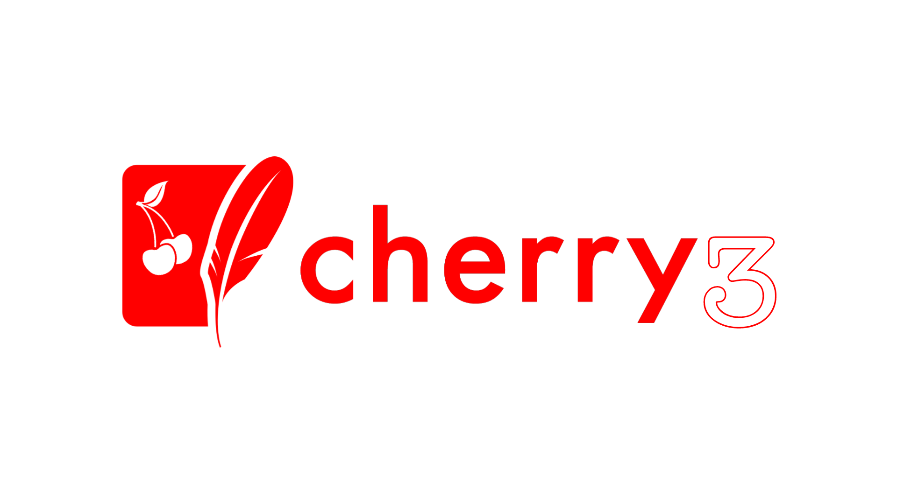

<br/>

<h4 align="center">Cherry3 is a SQlite And PostgreSQL object modeling tool designed to work in an asynchronous environment.</h6>
<p align="center">

 

 
 


<a href="https://discord.gg/luppux" target="_blank"> 
 
</a>
<a href="https://www.buymeacoffee.com/beykant" target="_blank">

</a>
</p>

#
## Installation

Using npm:
```shell
$ npm install cherry3

$ npm install sqlite3 -g   # ( For SQlite )
$ npm install pg -g   # ( For PostgreSQL )
```

Other Installations:

```bash
$ yarn add cherry3
```

```bash
$ pnpm add cherry3
```

#
## Features

* **Simple Setup:** Get started quickly with minimal configuration.
* **SQlite And PostgreSQL Storage:** Sqlite And PostgreSQL Will Come To Your Help Because It Is Compressed, Economical And Fast.
* **Asynchronous Operations:** Perform Database Operations Asynchronously Using Promises.
* **Filter and Update:** Easily filter and update records in your collections.
#
## Documentation
[*=>* **Click Here**](https://fivesobes.gitbook.io/cherry3/)
## Usage
```js
import { Model, Schema, Types } from 'cherry3';
/* const { Model, Schema, Types } = require('cherry3'); For CommonJS */

// Define a schema for a collection
const userSchema = Schema({
    username: { type: Types.String, default: 'fivesobes' },
    age: Types.Number,
    email: { type: Types.String, default: "support@luppux.com" },
    isAdmin: Types.Boolean,
    interests: Types.Array,
    balance: Types.Float,
    date: Types.Date
});

// Create a model for the "users" collection
const UserModel = new Model('Users', userSchema);


// Example data
const userData = {
  username: 'fivesobes',
  age: 20,
  email: 'support@luppux.com',
  isAdmin: false,
  interests: ['coding', 'reading', 'ertus-mom'],
};

(async () => {
// CRUD operations
  try {
    /* FIND USERS */

    // Find multiple users with conditions
    const users = await UserModel.find({ age: 20, isAdmin: false });
    console.log(users);


  } catch (error) {
    console.error('Error performing CRUD operations:', error.message);
  }
})();
```
#
## Settings File Definitions
[*=>* **Click Here**](https://fivesobes.gitbook.io/cherry3/sql-config-file)
#
## Types
```js
import { Types } from 'cherry3';

Types.Number // Example => 5
Types.Object // Example => { test:"data text", test3: 5 } 
Types.Date // Example => 1.03.2024
Types.String // Example => "test data text"
Types.Boolean // Example => true or false
Types.Array // Example => [ "five" , "so" , 5 ]
```
#
## Sqlite Viewer Extension
<a href="https://marketplace.visualstudio.com/items?itemName=yy0931.vscode-sqlite3-editor">  </a>

[For Visual Studio Code](https://marketplace.visualstudio.com/items?itemName=yy0931.vscode-sqlite3-editor)

## PostgreSQL And Other Database Viewer Extension
<a href="https://marketplace.visualstudio.com/items?itemName=cweijan.dbclient-jdbc">  </a>

[For Visual Studio Code](https://marketplace.visualstudio.com/items?itemName=cweijan.dbclient-jdbc)

## License

Cherry3 is licensed under the **GPL 3.0** License. See the [LICENSE](./LICENSE.md) file for details.

## Changelog

[*=>* **Click Here**](./CHANGELOG.md)

## Support

[](https://discord.gg/luppux)
